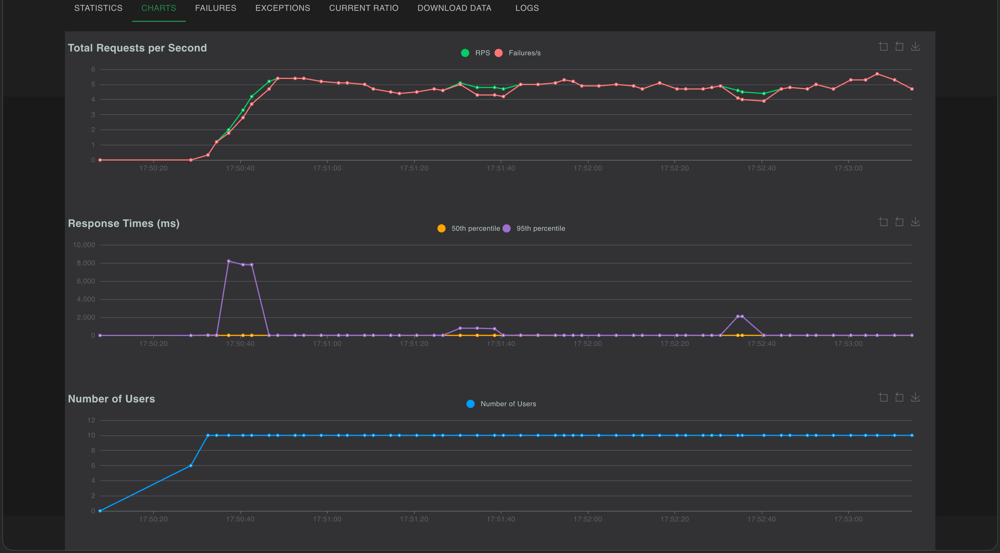

# Aegis Guard

**Aegis Guard** is a high-performance AI Gateway / Proxy compatible with the OpenAI API specification (`/v1/chat/completions`), built to orchestrate, secure, and observe local Large Language Model (LLM) inference running on **Ollama**.

It provides a production-ready middleware layer featuring API Key authentication, **dynamic rate limiting per client**, **vector semantic caching**, and structured logging for complete observability.

---

## 🚀 Key Features

* **OpenAI API Compatibility:** Exposes standard `/v1/chat/completions` endpoints that integrate seamlessly with official SDKs, Postman, or agent frameworks (LangChain, LlamaIndex).
* **API Key Rate Limiting:** Granular quota control (RPM - *Requests Per Minute*) backed by SQLite and evaluated on every incoming request with rejection latencies of $<10\text{ ms}$.
* **Vector Semantic Cache:** Cuts latency and inference compute by short-circuiting re-evaluations through vector storage and similarity indexing (can be toggled off for raw benchmark testing).
* **Resilience & Fallback:** Handles network drops gracefully and provides clear error mapping (`502 Bad Gateway`) for Ollama daemon connection issues.
* **Containerized Deployment:** Fully reproducible setup using **Docker Compose**, pre-configured for host-to-container communication across macOS, Linux, and Cloud environments.
* **Integrated Load Testing:** Automated benchmarking suite with **Locust** to evaluate concurrency and stress limits.

---

## 🛠️ Tech Stack

| Component | Technology |
| --- | --- |
| **Web Framework** | FastAPI (Uvicorn) |
| **Dependency Manager** | Poetry |
| **Local LLM Engine** | Ollama (`llama3:8b`) |
| **Relational Database** | SQLite (SQLAlchemy) |
| **Containerization** | Docker / Docker Compose |
| **Load Testing** | Locust |

---

## 📁 Project Structure

```text
aegis-guard/
├── docker-compose.yml       # Docker service configuration
├── Dockerfile               # FastAPI/Uvicorn container build file
├── pyproject.toml           # Project metadata & Poetry dependencies
├── seed.py                  # Database initialization & API Key generation script
├── locustfile.py            # Load and stress testing suite
├── .env.example             # Environment variable template
└── app/
    ├── main.py              # Main FastAPI app router & middleware
    ├── config.py            # Global app configurations
    ├── database.py          # Data models (User, APIKey) & SQLAlchemy sessions
    ├── rate_limiter.py      # Request rate limiting logic
    └── semantic_cache.py    # Vector search engine & semantic caching

```

---

## ⚙️ Configuration & Environment Variables

Create a `.env` file in the root directory based on the following template:

```env
# Gateway Configuration
OLLAMA_BASE_URL=http://host.docker.internal:11434

# Vector similarity threshold (0.0 to 1.0)
SEMANTIC_CACHE_THRESHOLD=0.88

# Disable cache to measure raw LLM latency
DISABLE_SEMANTIC_CACHE=true

```

---

## 🚀 Local Setup & Deployment Guide

### 1. Prerequisites

* **Docker Desktop** installed and running.
* **Ollama** installed locally with the `llama3` model pulled:
```bash
ollama pull llama3

```


---

### 2. Start Ollama Server (macOS)

To allow the Docker container to communicate with Ollama running on the macOS host, start Ollama bound to all network interfaces (`0.0.0.0`):

```bash
OLLAMA_HOST=0.0.0.0:11434 ollama serve

```

---

### 3. Seed Database & Generate API Key

In a second terminal, initialize the database and create a user with an associated API Key:

```bash
# Optional: Remove legacy database file
rm -f aegis_guard.db

# Run database seed
poetry run python seed.py

```

> ⚠️ **Note:** Copy the generated API Key printed to the console (formatted as `ag_live_...` or `ak_live_...`).

---

### 4. Launch the Proxy in Docker

Build and run the **Aegis Guard** container:

```bash
docker compose up --build -d

```

Verify container health by inspecting logs:

```bash
docker compose logs -f aegis-guard

```

The gateway server will be live at `http://localhost:8000`. Interactive API documentation is available at `http://localhost:8000/docs`.

---

## 🧪 API Usage Example

Chat Completion request (`POST /v1/chat/completions`):

```bash
curl -X POST http://localhost:8000/v1/chat/completions \
  -H "Content-Type: application/json" \
  -H "Authorization: Bearer YOUR_API_KEY_HERE" \
  -d '{
    "model": "llama3",
    "messages": [
      {"role": "user", "content": "Explain briefly what an API Gateway is."}
    ],
    "stream": false
  }'

```

---

## 📊 Load Testing & Performance Benchmark

Aegis Guard was subjected to concurrency stress testing using **Locust** running 10 virtual users sending continuous requests to `/v1/chat/completions`.



### Telemetry & Chart Analysis

1. **Throughput & Protection (Top Chart):**
   * The gateway sustained a total throughput of **~5.0 req/s**.
   * Red metrics (*Failures/s*) represent intentional **HTTP `429 Too Many Requests`** rejections triggered by the Rate Limiter to shield the local LLM backend from exhaustion.

2. **Latency Breakdown (Middle Chart):**
   * **Inference Overhead:** Uncached live model execution averages ~4.6s–8.0s (P95) on the local `llama3:8b` engine.
   * **Rate Limiter Overhead:** Rate-limited requests are short-circuited and rejected in **<10 ms** (median).

3. **System Stability (Bottom Chart):**
   * Zero unhandled process crashes (`500`/`502`) recorded across peak concurrency bursts with 10 continuous virtual users.

---

## 💡 Performance Takeaways

1. **Protection Efficiency:** The Rate Limiter blocks unauthorized/over-quota requests in $<10\text{ ms}$, shielding Ollama inference workers from resource exhaustion.
2. **Infrastructure Stability:** The FastAPI container handled high-concurrency bursts without connection leaks or elevated failure rates.
